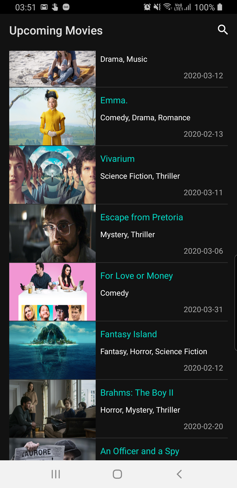

# Upcoming Movies

Here is a MVP android app which was made for a coding challenge.
This app runs over the Android 4.4 (API level 19) or later versions. 

## Features

- Discover the upcoming movies
- See the details like (poster images, release date, genres and overview)
- Search the upcoming movies by name

## How to Work with the Source

This app uses [The Movie Database API ³](https://www.themoviedb.org/documentation/api) API to retrieve movies.

## Screens

## Libraries

* [Retrofit](https://square.github.io/retrofit/): To handle http requests
* [Glide](https://github.com/bumptech/glide): To handle image requests
